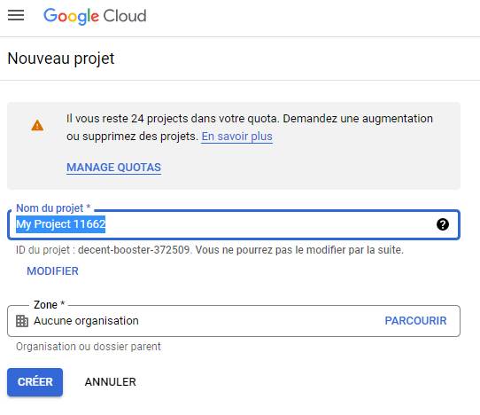
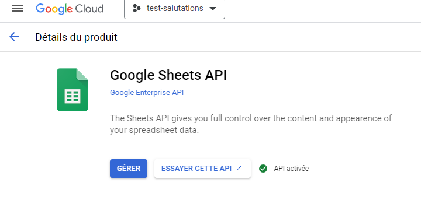
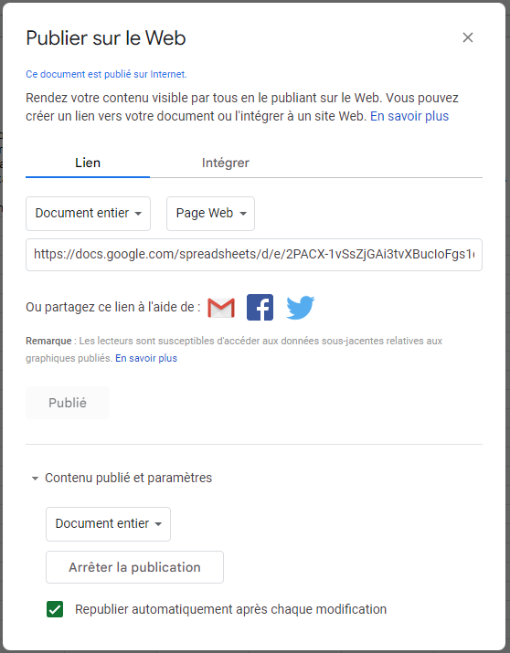

# Greetings generator
Webapp enabling you to pull e-mail greetings from a dataset contained in a Google Sheets document.

## Getting Started
Google Sheets offers a straightforward means to access data stored in a Google Sheets document, through their REST Google Sheets API *V4*, using the Sheets *published* URL.
Even though being a simple REST API usage, you need to set up you environment properly in order to access your data.

### 1. Enable the API
Since Google introduced Sheets API v4, you'll need to [create a Google Cloud Project](https://console.cloud.google.com/) **for free** and generate an API key to access any information from a Google Sheet.


Once the project is created, you'll need to enable the API for your project. You can do so by going to the [API Library](https://console.cloud.google.com/apis/library) and searching for the Google Sheets API.


Now that the API is activated, you should be able to create your API credentials. You can do so by going to the [Credentials](https://console.cloud.google.com/apis/credentials) page and clicking on the **Create credentials** button.

After selecting the **API key** option, you'll be able to copy your API key and use it in your application. Keep in mind that you should restrict the API key to only be used by your application, by restricting the API key to only be used from a specific domain or IP address.

### 2. Create and publish your Spreadsheet
This application being in it most basic form, it only supports a single Google Sheet document, with a specific structure.
The document can contain multiple sheets, but **only the first row** of each sheet should be populated. 


Once your datas are in place, you'll need to publish your document following the steps below:
1. Go to the **File** menu
2. Click on **Share** > **Publish to the web**
3. Select the **Entire document** option
4. In the next drop-down, choose either 'Web page' or 'Comma-separated values (.csv, current sheet)'
5. Expand the section **Published content and settings**
6. Check the **Automatically republish when changes are made** option
7. Click on the **Publish** button

This is what your settings should look like:


Then, you'll need to make the sheet available for anyone with the link:
1. Click on the **Share** button, top-right of the page.
2. In the **Get link** section, click on the **Change** button
3. Select the **Anyone with the link** option
4. Make sure the **View only** option is selected
5. Click on the **Save** button

### 3.Donwload and setup the application
Now that the preparation work is done, you can clone the repository and install the dependencies:
```bash
git clone
cd greetings-generator
npm install
```

Then, you'll need to dupplicate the config.example file and rename it to config:
```bash
cp config.example config
```

Next, you'll need to get your API key and Google Sheet ID and paste them in the config file:
1. Your API key can be found in the [Credentials](https://console.cloud.google.com/apis/credentials) page
2. Your Google Sheet ID can be found in the URL of your Google Sheet document. It should look like this: `https://docs.google.com/spreadsheets/d/1Z2X3C4V5B6N7M8K9L0J1H2G3F4D5S6A7/edit#gid=0`
The ID is the part between `/d/` and `/edit` in the URL. In the example above, the ID is `1Z2X3C4V5B6N7M8K9L0J1H2G3F4D5S6A7`

### 4. Run the application
Once the configuration is done, you can run the application:
```bash
npm run preview
```

## Add sheets and improve the dataset selection
As mentioned above, the application is in it's most basic form. It only supports a single Google Sheet document, with a specific structure.
It is though able to handle multiple sheets and to switch between datasets, with a single API call per sheet at the moment the application is loaded for the first time.

### Javascript
It means that you can add new sheets to your application, and make them selectable by the user, by adding the following javascript code to the `index.js` file:
```javascript
// Line 17, create a new array
let newArray = [];

//prefill the data with a basic json object, in case the API call fails
for (let i = 0; i < newArrayJSON.length; i++) {
  newArray.push(newArrayJSON[i]);
}

//Line 40, API call to get the data from the new sheet
const responseX = await fetch(
    `https://sheets.googleapis.com/v4/spreadsheets/${SHEET_ID}/values/SheetX?key=${SHEETS_API_KEY}`
  );

  const dataX = await response1.json(); 
```
Make sure that the `SheetX` part of the URL matches the name of the sheet you want to access.

Add this part to populate your array with the results of the API call:
```javascript
//check if the sheet1 is not empty, then push values in array
  if (data1.values[0]) {
    greetings = []; //data1.values[0] is an array of the values in the first row of the sheet1. populate the greetings array with the values

    for (let i = 0; i < data1.values[0].length; i++) {
      greetings.push(data1.values[0][i]);
    }
  }
  ```

Finally, find the ``shuffle()`` method, **around line 100 at this point** and add a new case to the switch statement:
```javascript
case "newArray":
      greeting = newArray[Math.floor(Math.random() * newArray.length)];
      break;
```
### Html
Now, you can add a new `option` element to the `select` element (line 42) in the `index.html` file:
```html
<option value="newArray">New Array</option>
```

## License
This project is licensed under the GNU General Public License v3.0 - see the [LICENSE](LICENSE) file for details

## Contributing
Feel free to contribute to this project. 
This project being one of the first I did more than a year ago, I see the progress I have made by coming back and trying to improve it. I know there are still many things for me to learn and I will use this project as a playground to try new things.

This particular project will be a nice reminder of the progress I have made, and I hope it will be useful to others as well.

## Demo
You can see a demo of the application [here](https://botte-cordiale.surge.sh)


